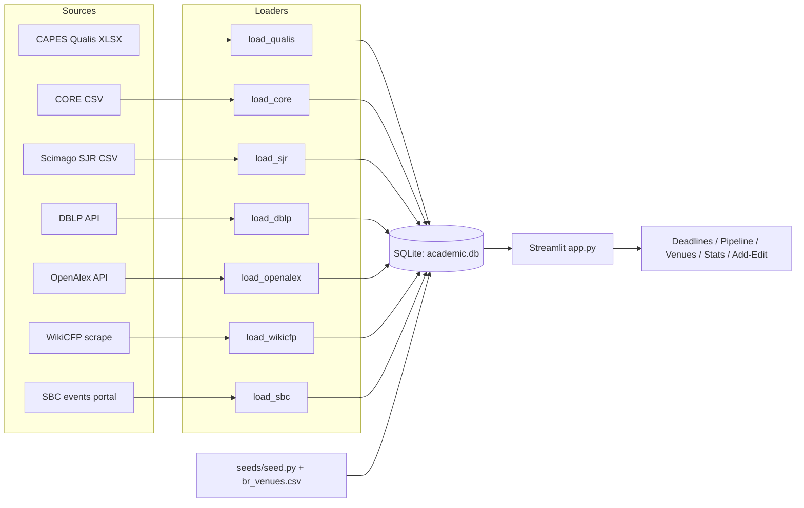

# academic-tracker

Local Streamlit dashboard for tracking CS / Information Sciences academic venues: deadlines, a submission pipeline, and rankings. It is Brazil-first (CAPES Qualis, SBC events) with international support, backed by a single local SQLite database.

[](LICENSE) [](https://www.python.org)

The app is single-user. Command-line loaders pull venue rankings and publication data from CORE, Scimago/SJR, DBLP, OpenAlex, and WikiCFP, writing into the same database the dashboard reads.

## Features

- **Deadlines view:** upcoming CFPs within a configurable window (7-365 days ahead), filterable by scope (BR / INT / both), with Qualis, CORE, and SJR quartile columns.
- **Submission pipeline:** board across nine statuses (idea, drafting, submitted, under review, revision, accepted, rejected, published, withdrawn).
- **Venues view:** full venue list with filters for Qualis, CORE, type, and submission mode, plus a panel for journals open for rolling submission.
- **Productivity stats:** submissions by status (Plotly bar chart) and computed acceptance rate over decided submissions.
- **Add / Edit:** manual entry forms for submissions, venues, and deadlines.
- **CLI loaders:** populate venue rankings and deadlines from external sources into the SQLite database.
- **BR site re-check:** `loaders/recheck.py` polls a fixed list of Brazilian event sites and flags when CFP-relevant keywords or content newly appear, persisting state to `data/recheck_state.json`.

## How it works

External data is pulled in via standalone CLI loaders (manual file imports or HTTP fetches), normalized, and written into a local SQLite database. The Streamlit app reads that database to render the dashboard views.



The database holds three tables: `venues`, `deadlines`, and `submissions` (see `schema.sql`).

## Requirements

- Python 3.12+
- Dependencies (see `requirements.txt`): streamlit, pandas, plotly, requests, beautifulsoup4, lxml, openpyxl, python-dateutil

## Installation

```bash
git clone https://github.com/fabricioguidine/academic-tracker.git
cd academic-tracker
python -m venv .venv
.venv\Scripts\activate          # Windows; use source .venv/bin/activate on Unix
pip install -r requirements.txt
python db.py                    # initialize the SQLite schema
python seeds/seed.py            # load the starter Brazilian venue list
```

## Usage

Launch the dashboard:

```bash
streamlit run app.py            # opens http://localhost:8501
```

Run loaders from the CLI as needed; each writes into `data/academic.db`:

```bash
python -m loaders.load_qualis   path/to/qualis.xlsx
python -m loaders.load_core     path/to/core.csv
python -m loaders.load_sjr      path/to/scimago.csv
python -m loaders.load_dblp     123/4567
python -m loaders.load_openalex 0000-0000-0000-0000
python -m loaders.load_wikicfp  "machine learning" databases
python -m loaders.load_sbc      2026
python -m loaders.recheck
```

## Data sources

| Source | Loader | What it provides | How it is accessed |
|---|---|---|---|
| CAPES Qualis | `load_qualis` | BR journal/conference Qualis tier | Manual XLSX download (Sucupira), matched by exact title |
| CORE | `load_core` | INT CS conference rank | Manual CSV export, matched by acronym |
| Scimago / SJR | `load_sjr` | INT journal best quartile | Manual CSV download, matched by exact title |
| DBLP | `load_dblp` | Your publications and their venues | HTTP fetch of the author PID XML |
| OpenAlex | `load_openalex` | Your works and host venues | HTTP API by ORCID (no key needed) |
| WikiCFP | `load_wikicfp` | INT conference deadlines | HTML scrape by topic search |
| SBC events | `load_sbc` | BR event list helper | Opens the SBC portal in a browser; deadlines entered manually |

## Project structure

```
academic-tracker/
├── app.py                  # Streamlit dashboard entry point
├── db.py                   # SQLite connection + schema bootstrap
├── schema.sql              # venues, deadlines, submissions tables
├── requirements.txt
├── data/
│   └── recheck_state.json  # persisted state for the BR site re-check
├── loaders/
│   ├── load_qualis.py
│   ├── load_core.py
│   ├── load_sjr.py
│   ├── load_dblp.py
│   ├── load_openalex.py
│   ├── load_wikicfp.py
│   ├── load_sbc.py
│   └── recheck.py
└── seeds/
    ├── seed.py             # loads the starter venue list
    └── br_venues.csv
```

## License

Released under the [MIT License](LICENSE).
